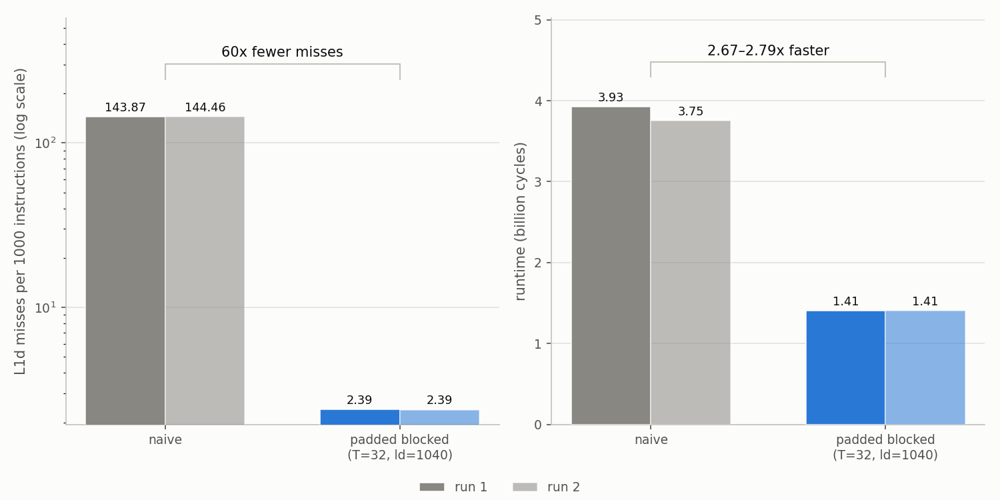
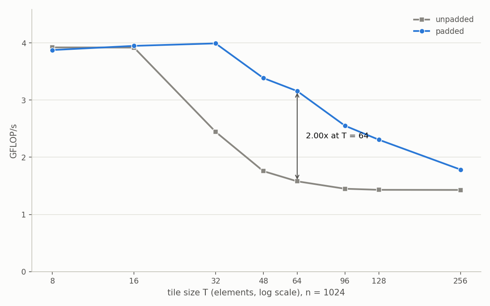

# WarpRoute

Cache and TLB microbenchmarks for the Apple M3 Pro, plus SGEMM kernels
instrumented with hardware performance counters. C++17, no external
dependencies. Predictions were written down before measuring and scored
afterwards: full record in [`notes/notes.md`](notes/notes.md), anomalies
and what explained them in [`notes/surprises.md`](notes/surprises.md).

## Measured

| Property | Value | How |
|---|---|---|
| L1d capacity | 128 KB | Pointer chase, capacity sweep |
| L1d associativity | 8 way | Set conflict sweep, break at K=9 |
| L1d line size | 128 B | `sysctl hw.cachelinesize` |
| L1d hit latency | 4.0 cycles | Cycle counter, dependent load chain |
| L2 capacity | 16 MB | Capacity sweep |
| L2 latency | 25.3 cycles | Two population model, measured L1 fraction |
| Page size | 16 KB | `sysctl hw.pagesize` |
| L1 dTLB | ~160 entries, ~2.4-2.5 MB reach | TLB sweep, knee between 144 and 192 pages |
| Warm P core clock | 4.02 GHz | Cycle counter against wall clock |
| Effective L1 residency | 79% of nominal | Measured miss counts vs capacity |

The dTLB knee is not resolved to a single entry count. Still open,
`notes/notes.md` Appendix B #5.

## SGEMM

| Kernel | L1d MPKI | Cycles | GFLOP/s |
|---|---|---|---|
| Naive | 144 | 3.75-3.93 G | 1.484 |
| Blocked, T=32, padded | 2.4 | 1.41 G | 3.992 |
| Accelerate (cblas_sgemm) | not measured | not measured | ~1118 |

All at n=1024. MPKI and cycles from `results/2026-09-16/`, GFLOP/s from
`results/2026-09-10/` and `results/2026-09-11/sgemm_naive.csv`. Accelerate
was never counter instrumented.

Each avoided miss is worth 2.2 to 2.4 cycles against 25.3 serial. The
misses are independent, so unlike the pointer chase, out-of-order
execution keeps many in flight and they do not pay L2 latency in series.



*L1d MPKI and cycles for both kernels, with each counter run plotted
separately rather than averaged.*

The unpadded optimum is T=8 to 16, not the T=64 to 104 that capacity
predicts: at n=1024 a power of two row stride maps tile rows into four
groups of sets. Padding the row stride to n+16 fixes it, and the padded
optimum moves up to T=32.



*Tile size sweep at n=1024, padded row stride against unpadded.*

## Counters

macOS has no public PMU API; this reads the private kperf/kpc interfaces
directly. The configurable counter class intermittently fails to arm while
reporting success, returning exact zeros, so it is guarded by a forced
state read back, a config read back, and a self test that aborts rather
than measuring. It still fails about one attempt in three, and
`run_counters.sh` retries. The config read back masks bit 17, the EL0
AArch64 enable the kernel adds itself, determined by disassembling
`kperfdata` and the kernel binary.

## Build

```bash
cmake -B build && cmake --build build
```

## Run

```bash
./build/warproute info               # topology from sysctl
./build/warproute tlb                # TLB reach sweep

./build/probe capacity               # cache capacity sweep
./build/probe assoc                  # L1d associativity
./build/probe saxpy                  # SAXPY bandwidth
./build/probe sgemm-bench            # naive SGEMM baseline
./build/probe sgemm-sweep            # tile sweep
./build/probe sgemm-sweep-padded     # tile sweep, row stride n+16

./build/tests                        # correctness
```

`./build/probe` with no argument lists every sweep, including the
verify-only ones. The Accelerate ceiling needs its thread count pinned
for the single-threaded figure:

```bash
VECLIB_MAXIMUM_THREADS=1 ./build/probe sgemm-bench-blas
```

```bash
sudo ./scripts/run_counters.sh ./build/counters       # latency in cycles
sudo ./scripts/run_counters.sh ./build/sgemm_counters # SGEMM MPKI
```

Counters need root. A run that aborts with `counter self-test failed`
measured nothing; rerun it.

```bash
python3 scripts/plot_assoc.py
python3 scripts/plot_latency_hierarchy.py
python3 scripts/plot_l1_residency.py
python3 scripts/plot_mpki_vs_runtime.py
python3 scripts/plot_tile_sweep.py
```

Needs pandas and matplotlib. Nothing is hardcoded; each script parses its
source data.

## Protocol

Measurement rules and the mistakes behind them: `notes/notes.md`,
Appendix D.

## Other hardware

Kernels, probes and harness are portable C++17; the counter layer is not.
Other Apple Silicon should work as is, Linux needs a `perf_event_open`
wrapper in place of `src/counters.cpp`, and x86 needs the probes rerun
for 64 B lines and 4 KB pages.

## Open

Nine questions with next steps in `notes/notes.md`, Appendix B: seven
open, one mitigated with its root cause unknown, one resolved. Largest:
the blocked kernel's miss count came in 7x above prediction and is not
explained.

Prefetcher reach was never measured. The chase defeats it, the SAXPY
sweep exploits it, neither characterizes it. Scoped out of v1.

## Attribution

The kperf/kpc/kpep declarations in `src/counters.cpp` come from
[ibireme's public domain gist](https://gist.github.com/ibireme/173517c208c7dc333ba962c1f0d67d12),
as does the call sequence. The `kpep_event` field layout is this
project's; the gist declares the event number as one byte, too small for
this machine's database. Offsets recovered from `dyld_info -disassemble`.
